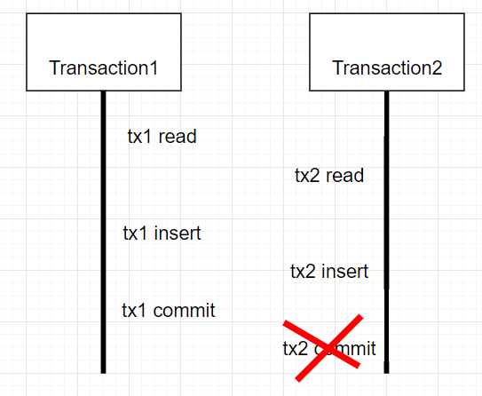

# blog-searcher-java-springboot

## 기능 요구사항

1. 블로그 검색

- 키워드를 통해 블로그를 검색할 수 있습니다.
- 검색 결과에서 Sorting(정확도순, 최신순) 기능을 지원합니다.
- 검색 결과는 Pagination 형태로 제공합니다.

2. 인기 검색어 목록

- 사용자들이 많이 검색한 순서대로, 최대 10개의 검색 키워드를 제공합니다.

## 개발 환경

- Java 17
- Spring Boot 2.7
- Gradle 7.6
- JPA
- QueryDSL

## 외부 라이브러리 목록

| Dependency                                          | Version | Purpose                                                            |
| ---------------------------------------------------- | ------- | ------------------------------------------------------------------ |
| io.github.resilience4j:resilience4j-all              | 2.0.2   | 서킷브레이커 기능을 제공하는 라이브러리                                |
| com.h2database:h2                                   | 2.1.214 | 테스트용 인메모리 데이터베이스 라이브러리                                 |
| org.apache.httpcomponents:httpclient                | 4.5.14  | HTTP 클라이언트 기능을 제공하는 라이브러리                              |
| it.ozimov:embedded-redis                            | 0.7.2   | 테스트용 내장 Redis 인스턴스를 제공하는 라이브러리                         |
| com.querydsl:querydsl-jpa                            | 5.0.0   | JPA를 사용하여 타입 안전한 쿼리를 작성할 수 있게 도와주는 라이브러리    |
| com.querydsl:querydsl-apt                            | 5.0.0   | Querydsl을 사용하기 위한 애노테이션 프로세서 라이브러리                 |

| Test Dependency                                     | Version | Purpose                                        |
| ---------------------------------------------------- | ------- | ---------------------------------------------- |
| com.h2database:h2                                   | 2.1.214 | 테스트용 인메모리 데이터베이스 라이브러리             |
| it.ozimov:embedded-redis                            | 0.7.2   | 테스트용 내장 Redis 인스턴스를 제공하는 라이브러리    |

## Challenge

### 인프라스트럭처 모듈에서 예외가 발생했을 때 프레젠테이션 계층은 어떻게 예외를 판단할까?

- 모듈의 경계 간 분리로 인해 예외를 전파하는 전략으로 판단
    1. Infrastructure 계층 예외 발생 시 -> Domain 계층의 예외로 포장하여 전파합니다.
    2. Domain 계층 예외는 Presentation 계층으로 전파 후 ExceptionHandler 에서 사용자에게 예외를 전달하도록 구현하였습니다.

계층마다 예외 발생 시 로그를 남기도록 하였으며, 서버, 외부 API의 장애가 아닌 클라이언트의 오류(검색어 누락) 는 사용자에게 예외를 전달하도록 구현하였습니다.

### 다수의 사용자가 동시에 검색을 요청하는 경우 트랜잭션의 범위를 어떻게 설정해야 할까?



존재하는 테이블의 로우에 접근하는 경우 데이터베이스의 비관적, 낙관적 락이 있습니다. 하지만 구현하면서 생각한 프로세스는 아직 저장되지 않은 시점에 동시에 다수의 사용자가 존재하지 않은 로우에 접근했을 때 동시성 문제가 발생할 수 있다고
판단했습니다. 해당 문제는 트랜잭션의 범위를 `조회 -> 저장, 조회 -> 수정` 으로 설정하고 Redisson 분산 락을 활용하여 동시성 문제를 해결하였습니다.

### 새로운 검색 소스가 추가되었을 때 어떻게 하면 유연하게 대응할 수 있을까?

기본으로 제공하는 카카오 API 를 기준으로 공통된 필드를 추출하고 인터페이스로 추상화하여 확장에 고려한 설계를 하였습니다.

```
public interface ApiResponseDto {

    List<BlogApiPost> getContents();

    BlogApiMetadata getMeta();
}
```

### TO-BE

현재 검색기록 저장과 업데이트가 하나의 트랜잭션으로 묶여 분산 락으로 구현되고 있는데, Redis Redisson 장애가 발생 시 서비스 전체에 장애가 전파될 수 있는 구조를 가지고 있습니다. Redis 구성을 이중화 하거나, 동시성 문제를 다른 방법으로 해결할 수 있는지 고려해야 합니다.

## Overall Architecture


## API 명세

### 블로그 검색

```
GET /api/v1/blog/search
```

> Request

| 필드명 | 타입 | 설명 | 필수 여부
| --- | --- | --- | --- |
| query | String | 검색어 | O | 
| page | Integer | 페이지 번호 (기본값: 1) | X |
| sort | String | 정렬 기준 (기본값: "accuracy") accuracy(정확도순) 또는 recency(최신순) | X |

> Response

**Message:** success

| 필드명    | 타입   | 설명                      |
| --------- | ------ | ------------------------- |
| documents | array  | 블로그 목록         |
| meta      | object | 메타정보 객체 |

### `documents` 필드

| 필드명    | 타입   | 설명                      |
| --------- | ------ | ------------------------- |
| blogname  | string | 블로그 이름               |
| contents  | string | 블로그 내용                 |
| datetime  | string | 작성 일시            |
| thumbnail | string | 블로그 썸네일 이미지 URL         |
| title     | string | 블로그 제목                 |
| url       | string | 블로그 URL                  |

### `meta` 필드

| 필드명        | 타입    | 설명                              |
| ------------- | ------- | --------------------------------- |
| isEnd         | boolean | 마지막 페이지 여부 (true/false) |
| pageableCount | integer | total_count 중 노출 가능 문서 수 |
| totalCount    | integer | 검색 결과 문서 총 개수             |

### 인기검색어 조회

```
GET /api/v1/popular/search
```

> Response

**Message:** success

| 필드명 | 타입 | 설명 | 
| --- | --- | --- |
| keyword | String | 검색어 |  
| count | int | 조회수 |

### Circuit Breakers

```
GET /actuator/circuitbreakers
```

> Response

| 필드명 | 설명 |
|---|---|
| failureRate | 실패율 |
| slowCallRate | 느린 요청 비율 |
| failureRateThreshold | 실패율 임계값 |
| slowCallRateThreshold | 느린 요청 비율 임계값 |
| bufferedCalls | 버퍼링된 요청 수 |
| failedCalls | 실패한 요청 수 |
| slowCalls | 느린 요청 수 |
| slowFailedCalls | 느린 요청 중 실패한 요청 수 |
| notPermittedCalls | 차단된 요청 수 |
| state | 서킷 브레이커의 상태 (OPEN, CLOSED, HALF_OPEN) |


### Health Check

```
GET /actuator/health
```

> Response

| Component       | Status  | Details                                           |
| --------------- | ------- | -------------------------------------------------- |
| circuitBreakers | UNKNOWN |                                                  |
| db              | UP      | database: H2, validationQuery: isValid()          |
| diskSpace       | UP      | total: 0, free: 0, threshold: 0, exists: true |
| ping            | UP      |                                                  |
| redis           | UP      | version: 2.8.19                                   |

## 다운로드 및 실행

https://github.com/minsoozz/blog-searcher-java-springboot/blob/main/lib/blog-searcher.jar

```
java -jar blog-searcher.jar
```

### 참고 사항

- 애플리케이션, 레디스 포트가 이미 실행중인 경우 프로젝트가 정상적으로 실행되지 않을 수 있습니다.
